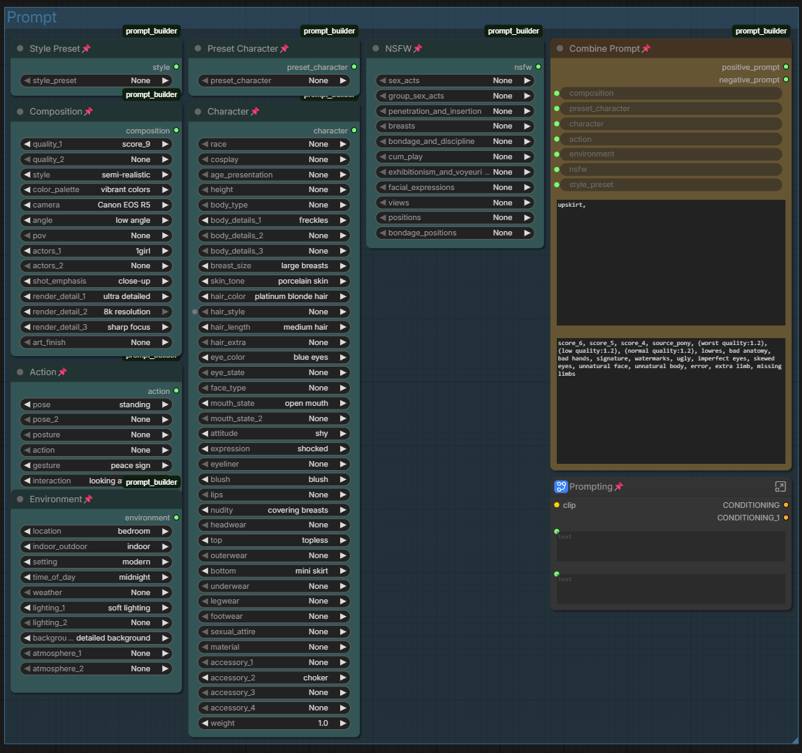
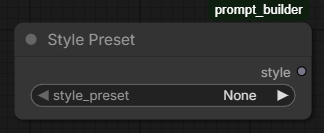
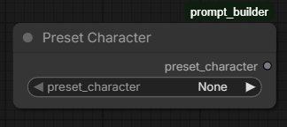
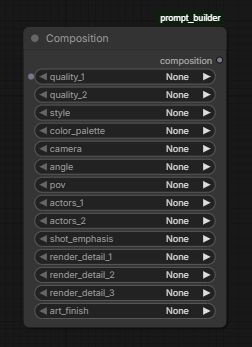
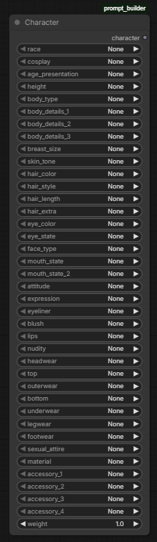
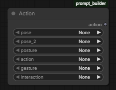
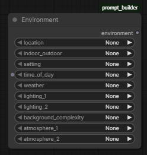
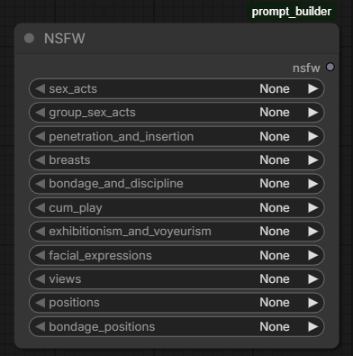
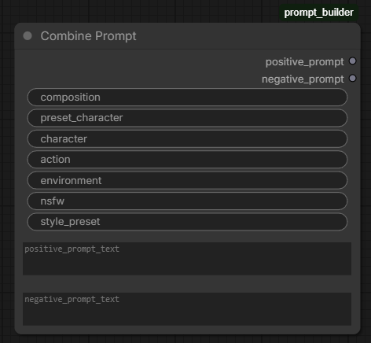

# ComfyUI Prompt Builder

A structured, dropdown-based prompt builder for ComfyUI.

This tool is designed to make image generation easier, faster, and more consistent—especially for users who don’t want to manually write long prompts or user's who may be new to prompting for image/video generation.

Instead of typing everything out, you build prompts by selecting from curated options like character traits, clothing, poses, environments, and more using Danbooru tags. The system then combines everything into a clean, usable prompt.

---

## Overview



This workflow provides a modular system of nodes that:

- Break prompts into logical sections (character, clothing, pose, etc.)
- Provide curated dropdowns instead of freeform typing
- Combine everything into a final prompt automatically
- Keep things flexible while providing user's with a list of words most models react well to.

---

## Features

- Structured prompt building (no prompt knowledge required)
- Large curated dataset (~3000+ Danbooru approved tags)
- Clean separation of prompt sections
- Supports SFW and NSFW workflows
- Highly customizable via `presets.json`
- Easily expandable without touching core code

---

## Installation

### Option 1 — ComfyUI Manager (Recommended)

1. Open ComfyUI
2. Open **Manager**
3. Search for: `Prompt Builder`
4. Install
5. Restart ComfyUI

---

### Option 2 — Manual Install

Manually download or clone the repository:

```bash
git clone https://github.com/zinigo-creations/comfyui-prompt-builder
```

Move the folder into:

```
ComfyUI/custom_nodes/comfyui-prompt-builder
```

Restart ComfyUI.

---

## How It Works

The system is built around modular nodes that each handle a section of the prompt.

Each node pulls its options from `presets.json`, meaning everything is data-driven and easy to modify.

---

## Nodes

### Style Preset



Defines the overall visual direction (anime, cinematic, fantasy, etc).  
This has a major influence on the final output.

---

### Preset Character



Quick-select from a large list of known characters.  
Useful for fast generation and consistency.

---

### Composition



Controls how the image is framed.

Includes:

- camera type
- angle
- shot type
- quality tags

---

### Character



Defines the subject of the image.

Includes:

- body type
- hair (color, style, extras)
- eyes
- clothing
- accessories

This is the most detailed and impactful section.

---

### Action



Defines what the character is doing.

Includes:

- pose
- gestures
- movement

Helps avoid stiff or static results.

---

### Environment



Controls where the scene takes place.

Includes:

- location
- lighting
- time of day
- atmosphere

---

### NSFW (Optional)



Adds additional layered detail for more mature outputs.

This node is optional and can be ignored entirely.

---

### Combine Prompt



Where the other nodes hook up and to merge all selections into a final prompt.

You can also:

- add custom text
- override generated output

---

## Customization

All dropdown options are defined in:

```
presets.json
```

You can:

- add new tags
- modify existing ones
- create entirely new sections

No code changes required.

---

## Contributing

Contributions are welcome.

### How to contribute

1. Fork the repository
2. Create a new branch
3. Make your changes
4. Submit a pull request

---

### Guidelines

- Keep naming consistent (e.g. `black hoodie`, not `Hoodie Black`)
- Prefer commonly used tags (Danbooru-style works best)
- Avoid duplicates and redundant entries (before adding use ctrl+f) to make sure it's not in the list already
- Test your changes before submitting

---

### Content Guidelines

Please use common sense and good judgment when contributing.

- Do not add illegal, or otherwise harmful content
- Avoid content that would make the project unsafe or inappropriate for general use
- If a tag feels questionable, it probably is — leave it out

---

## Notes

- Not all tags behave the same across models
- Simpler prompts often produce better results
- This tool is designed to guide, not restrict

---

## License

MIT

---

## Final

If you enjoy the workflow or have suggestions, feel free to open an issue, PR or reach out.
